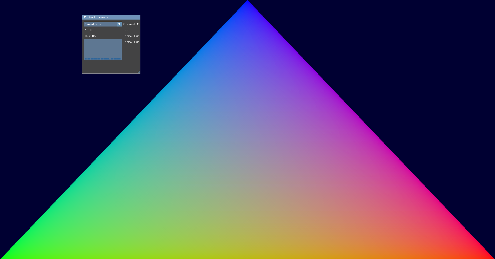
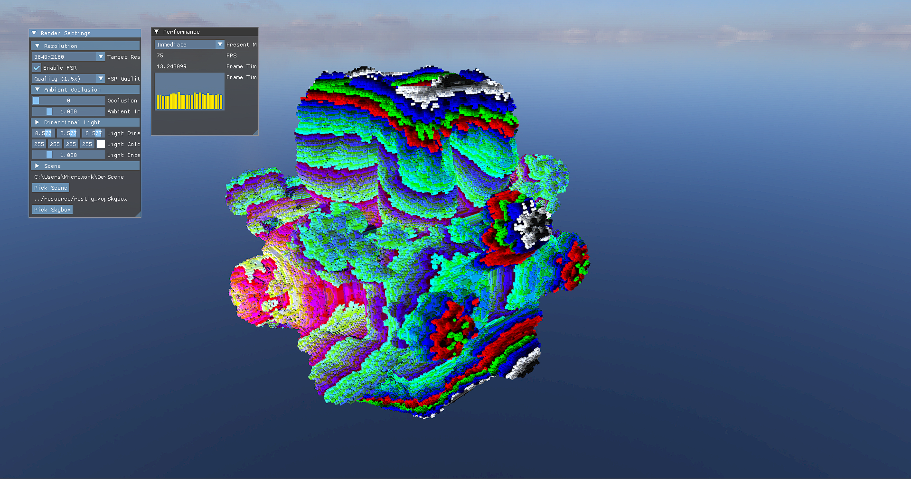

# VARCHER

### (formerly 'Voxel Ray Marcher')

Now a Vulkan learning environment, aiming to provide small examples from Ray Tracing, Particle Systems, Compute Pipelines and much more in the future. 

## Showcase

### Simple Triangle renderer


### Voxel Raytracer demo with a [mandlebulb](resource/mandlebulb.vox) model.


### Galaxy Renderer
TODO

## Building

- vcpkg to manage dependencies.
- CMake + Ninja
- CLANG / MSVC tested (Should work on Linux and Windows)
- GCC does not compile successfully

### Linux
You need to set a variable called VCPKG_ROOT (root of your vcpkg) for the build to work on linux with the default cmake preset.

```bash
cmake --preset=default
mkdir build
cmake --build build
```

Also FSR2 is not supported on Linux, so it is not available for implementations using it, only windows.

### Windows
You need to set a variable called VCPKG_ROOT (root of your vcpkg) for the build to work with MSVC or MINGW.

```bash
cmake --preset=default
mkdir build
cmake --build build
```

### CLion
Set `-DCMAKE_TOOLCHAIN_FILE=path/to/your/vcpkg/scripts/buildsystems/vcpkg.cmake` in the Cmake options. Optionally you can set up vcpkg for CLion.

